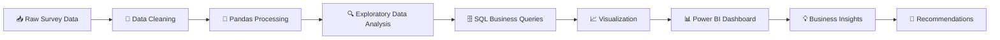

<!-- ========================================================= -->
<!-- ☕ GREAT AMERICAN COFFEE TASTE TEST ANALYSIS -->
<!-- Premium Recruiter-Level GitHub README -->
<!-- ========================================================= -->

<div align="center">


<br>


<br><br>


<br><br>

</div>

---

<div align="center">

# ☕ PREMIUM COFFEE ANALYTICS EXPERIENCE

### Turning Coffee Preferences Into Actionable Business Intelligence

</div>

<br>

<div align="center">

<table>
<tr>
<td width="33%" align="center">

### 📊 Survey Analytics
Consumer Behavior Analysis

</td>

<td width="33%" align="center">

### ☕ Brewing Intelligence
Coffee Habit Insights

</td>

<td width="33%" align="center">

### 📈 Business Impact
Data-Driven Decisions

</td>
</tr>
</table>

</div>

---

<svg width="100%" height="12">
<rect width="100%" height="12" fill="#C8894A"/>
</svg>

# ✨ Project Overview

<div align="center">

> ### A comprehensive analytics project exploring coffee consumption behavior, brewing preferences, caffeine habits, purchasing patterns, and consumer trends using real-world survey data.

</div>

<br>

<table>
<tr>
<td width="50%">

### 🎯 Objective

Transform raw survey responses into meaningful business insights by identifying:

- Consumer coffee preferences
- Brewing method popularity
- Spending patterns
- Caffeine consumption trends
- Demographic behavior
- Purchase decision factors

</td>

<td width="50%">

### 📦 Deliverables

✅ Data Cleaning

✅ Exploratory Data Analysis

✅ SQL Business Queries

✅ Data Visualization

✅ Interactive Dashboard

✅ Executive Insights

</td>
</tr>
</table>

---

# 📌 Project KPIs

<div align="center">

<table>
<tr>

<td align="center" width="25%">

## ☕
### Coffee Types
Consumer Preferences

</td>

<td align="center" width="25%">

## 💰
### Spending
Behavior Analysis

</td>

<td align="center" width="25%">

## ⚡
### Caffeine
Consumption Trends

</td>

<td align="center" width="25%">

## 📊
### Brewing
Habit Analysis

</td>

</tr>
</table>

</div>

---

# 🛠️ Technology Stack

<div align="center">

<table>
<tr>

<td align="center" width="20%">


### Python

Data Processing

</td>

<td align="center" width="20%">


### SQL

Business Queries

</td>

<td align="center" width="20%">


### Power BI

Dashboarding

</td>

<td align="center" width="20%">


### Matplotlib

Visual Analytics

</td>

<td align="center" width="20%">


### Seaborn

Statistical Viz

</td>

</tr>
</table>

</div>

---

# ⚙️ Analytics Workflow



---

# ❓ Business Questions Solved

<table>
<tr>
<td>

### ☕ Consumer Behavior

- Most preferred coffee type?
- Favorite brewing methods?
- Daily consumption habits?
- Coffee purchase channels?

</td>

<td>

### 💰 Spending Patterns

- Monthly spending trends?
- Premium vs budget consumers?
- Spending by demographic groups?

</td>
</tr>

<tr>
<td>

### ⚡ Caffeine Insights

- Preferred caffeine levels?
- Heavy caffeine users?
- Age-based consumption patterns?

</td>

<td>

### 📈 Market Intelligence

- Emerging consumer trends?
- Popular coffee additions?
- Opportunity segments?

</td>
</tr>
</table>

---

# 💡 Key Insights

<div align="center">

<table>
<tr>
<td width="33%" align="center">

### 🏆 Preference Analysis

Identified dominant coffee preferences and brewing choices across respondents.

</td>

<td width="33%" align="center">

### ⚡ Consumption Trends

Uncovered caffeine consumption behavior and daily coffee intake patterns.

</td>

<td width="33%" align="center">

### 💰 Market Opportunities

Highlighted spending behaviors and customer segments with high value potential.

</td>

</tr>
</table>

</div>

---

# 📊 Dashboard Preview

<div align="center">

### ☕ Power BI Executive Dashboard

<br>


<br><br>

> Replace the image above with your dashboard screenshot

</div>

---

# 📂 Project Structure

```text
📦 Great-American-Coffee-Taste-Test
│
├── 📁 Data
│   ├── coffee_survey.csv
│
├── 📁 SQL
│   ├── business_queries.sql
│
├── 📁 Python
│   ├── data_cleaning.ipynb
│   ├── exploratory_analysis.ipynb
│
├── 📁 Visualizations
│   ├── charts/
│
├── 📁 Dashboard
│   ├── Coffee_Analysis.pbix
│
├── 📁 Assets
│   ├── dashboard_preview.png
│
└── README.md
```

---

# 📈 Analytics Deliverables

| Deliverable | Status |
|------------|---------|
| Data Cleaning | ✅ |
| EDA | ✅ |
| SQL Analysis | ✅ |
| Data Visualization | ✅ |
| Dashboard Creation | ✅ |
| Insight Generation | ✅ |

---

# 🔍 Interactive FAQ

<details>
<summary><b>☕ What dataset was used?</b></summary>

Survey responses from the Great American Coffee Taste Test dataset containing coffee consumption and preference information.

</details>

<details>
<summary><b>📊 Which tools were used?</b></summary>

Python, Pandas, SQL, Matplotlib, Seaborn, and Power BI.

</details>

<details>
<summary><b>⚡ What business value does this project provide?</b></summary>

The analysis uncovers consumer preferences, purchasing behavior, caffeine habits, and market opportunities useful for coffee brands and retailers.

</details>

<details>
<summary><b>📈 What insights can stakeholders gain?</b></summary>

Consumer segmentation, spending trends, brewing preferences, demand patterns, and product positioning opportunities.

</details>

<details>
<summary><b>🚀 Why is this project portfolio-worthy?</b></summary>

It demonstrates the complete analytics lifecycle from raw data to executive-level dashboarding and business insight generation.

</details>

---

# 🏅 Recruiter Highlights

<div align="center">

<table>
<tr>

<td align="center">

### 🐍 Python Analytics

Data Cleaning • EDA • Insights

</td>

<td align="center">

### 🗄 SQL Expertise

Business Query Development

</td>

<td align="center">

### 📊 BI Dashboarding

Interactive Reporting

</td>

<td align="center">

### 💡 Storytelling

Insight-Driven Decisions

</td>

</tr>
</table>

</div>

---

<div align="center">


# ☕ Great American Coffee Taste Test Analysis

### Data • Insights • Visualization • Business Intelligence

<br>


<br><br>

### Crafted for Data Analytics Portfolio Excellence

⭐ If you found this project interesting, consider starring the repository.

</div>
